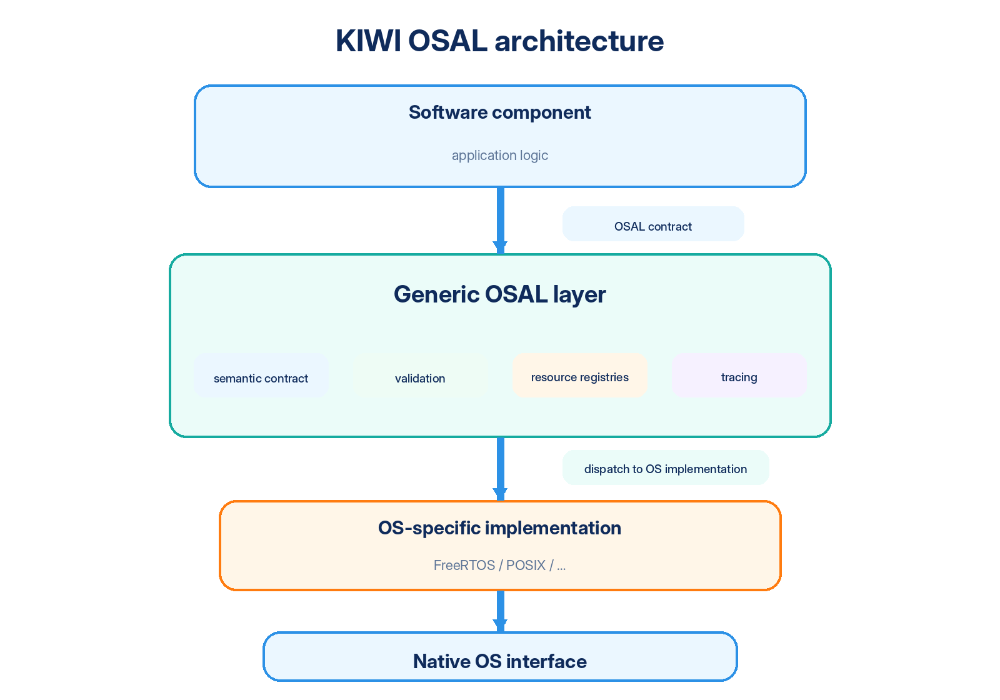
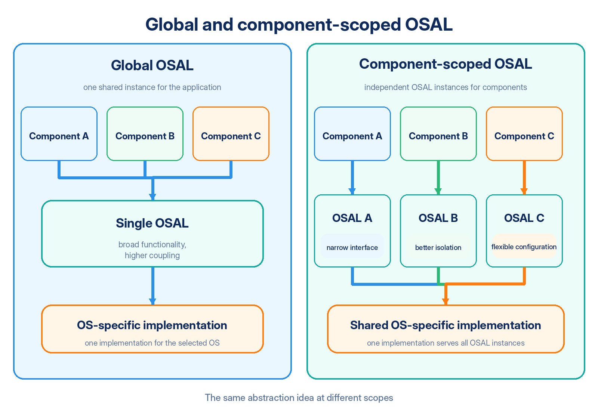
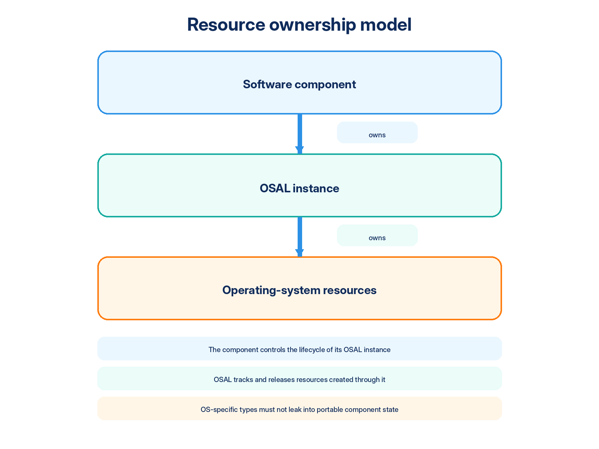
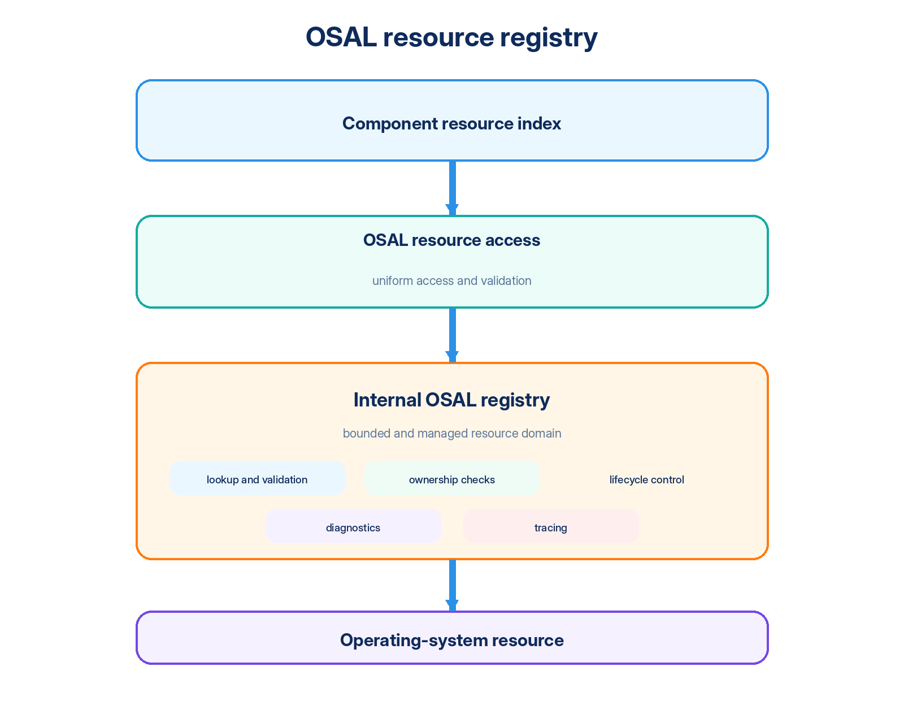
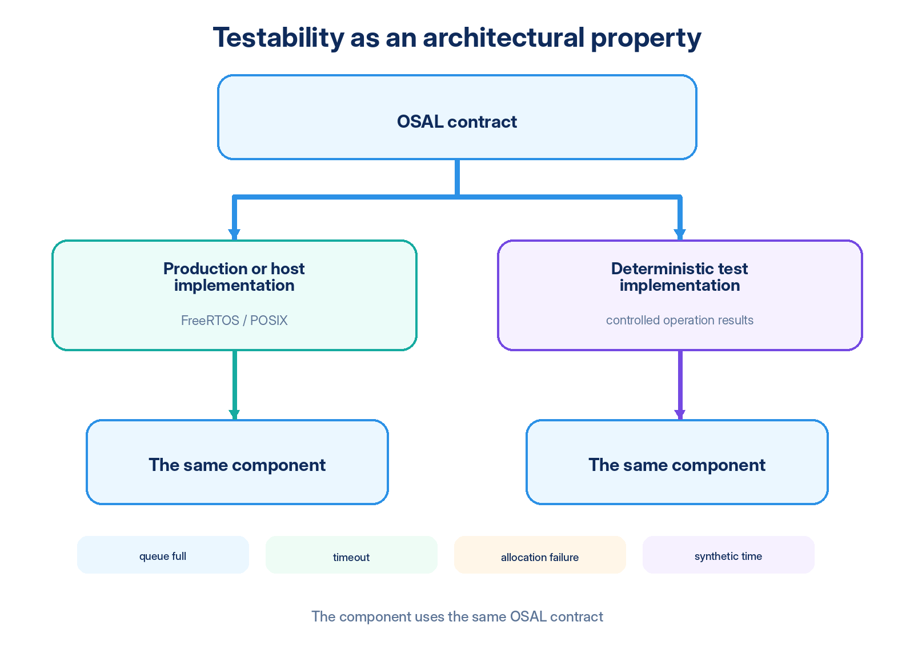

# KIWI OSAL Architecture

> **Notation used in this document.** Identifiers prefixed with `TEMPLATE` / `Template` refer to generator templates. During generation, that prefix is replaced with the selected module prefix (`<ModulePrefix>`; casing follows the naming rules). For example, `TEMPLATE_OSAL_QUEUE_SLOTS_NUM` becomes `<MODULE_PREFIX>_OSAL_QUEUE_SLOTS_NUM`, while `Template_osalQueueCreate()` becomes `<ModulePrefix>_osalQueueCreate()`. To keep examples generic and independent of any particular project, this document uses the template prefixes `TEMPLATE` / `Template` throughout.

## Contents

1. [What is an OSAL?](#1-what-is-an-osal)
2. [What problem does an OSAL solve?](#2-what-problem-does-an-osal-solve)
3. [The cost of abstraction](#3-the-cost-of-abstraction)
4. [One contract — one meaning](#4-one-contract--one-meaning)
5. [KIWI OSAL architectural model](#5-kiwi-osal-architectural-model)
6. [Code generation as part of the architecture](#6-code-generation-as-part-of-the-architecture)
7. [Global and component-scoped OSAL](#7-global-and-component-scoped-osal)
8. [Relationship to SOLID](#8-relationship-to-solid)
9. [Multi-instance model](#9-multi-instance-model)
10. [Resource ownership model](#10-resource-ownership-model)
11. [Resource registries and stable indices](#11-resource-registries-and-stable-indices)
12. [Runtime validation and assertions](#12-runtime-validation-and-assertions)
13. [Tracing and diagnostics](#13-tracing-and-diagnostics)
14. [Internal resource synchronization](#14-internal-resource-synchronization)
15. [Testability as part of the architecture](#15-testability-as-part-of-the-architecture)
16. [Requirements for an OS-specific implementation](#16-requirements-for-an-os-specific-implementation)
17. [Why another abstraction layer?](#17-why-another-abstraction-layer)
18. [What KIWI OSAL deliberately does not do](#18-what-kiwi-osal-deliberately-does-not-do)
19. [When an OSAL may be unnecessary](#19-when-an-osal-may-be-unnecessary)
20. [Common objections](#20-common-objections)
21. [Current KIWI OSAL primitive groups](#21-current-kiwi-osal-primitive-groups)
22. [References and further reading](#22-references-and-further-reading)

---

## 1. What is an OSAL?

**OSAL means Operating System Abstraction Layer.**

Its primary purpose is to separate a software component from a specific operating system and its API by providing a stable set of operations for OS resources such as threads, queues, synchronization primitives, timers, time, memory, and other system services.

At first glance, an OSAL may look like a set of thin wrappers that merely rename native calls:

| Native OS call | Example wrapper |
| --- | --- |
| `xQueueSend()` | `osalQueuePut()` |
| `xSemaphoreTake()` | `osalMutexLock()` |
| `vTaskDelay()` | `osalThreadDelay()` |

Renaming functions, however, does not create a meaningful abstraction by itself.

Operating systems differ in much more than function names. They may differ in:

- object models;
- API signatures, sometimes substantially;
- native object identifier and handle types;
- resource creation, ownership, and destruction rules;
- timeout units and the representation of an infinite wait, for example kernel ticks, milliseconds, or other units;
- error models, return-code sets, and result-reporting conventions;
- restrictions on calls from thread context versus interrupt context: FreeRTOS, for example, provides separate ISR variants for a number of APIs;
- scheduler and priority models, including the number of priority levels, valid ranges, and the direction in which numeric priority values increase;
- behavior that is explicit in one OS but implicit in another, such as the representation of an unbounded wait;
- historically accumulated terminology: equivalent operations may be called `create`, `init`, `new`, or something else in different environments.

The central KIWI OSAL principle is therefore:

> **An OSAL abstracts semantics, not function names.**

A component should know **what** it needs to do, while remaining unaware, as far as practical, of **how** a particular operating system performs that operation.

This shifts the focus from implementation mechanics to intent: not “which FreeRTOS function should be called in this context?”, but “which system operation does the component require?”.

<p align="center"></p>

---

## 2. What problem does an OSAL solve?

Direct use of an operating-system API is natural while a component targets a single platform. In a small FreeRTOS application, it may be entirely reasonable to store `QueueHandle_t`, call `xQueueSend()`, and handle FreeRTOS-specific rules directly, including ISR restrictions, kernel-tick-based timeouts, and other kernel conventions.

The problem appears as the component grows. The dependency on one OS begins to spread into data structures, error handling, timeout rules, initialization and teardown, and code paths that depend on execution context.

A single component can gradually become a mixture of:

- application-domain logic;
- OS-specific behavior;
- system-resource management;
- execution-context checks;
- time-unit conversion;
- translation of native OS failures into domain-level results.

This is particularly harmful in complex protocols, drivers, communication stacks, and services, where system-call mechanics can obscure an application problem that is already difficult enough on its own.

Instead of reasoning only about protocol or device state, the developer must repeatedly remember:

- whether an operation is legal from an ISR;
- whether a dedicated ISR variant exists and which context the current code can execute in;
- which units a timeout uses;
- who owns a created object and therefore controls its lifecycle;
- how already-created resources must be released after partial initialization fails;
- how the selected OS represents failure or timeout.

KIWI OSAL moves these concerns to an explicit architectural boundary. The component depends on its own constrained OS contract instead of depending directly on FreeRTOS, POSIX, or another operating system.

Portability is an important result, but not the only one. The same boundary also provides a foundation for:

- isolated testing;
- uniform precondition validation;
- centralized bookkeeping of OS resources;
- deterministic cleanup;
- tracing of OS interactions;
- lifecycle diagnostics for the component and its system resources;
- reducing platform-specific details in application code to the minimum that is actually necessary.

---

## 3. The cost of abstraction

Every additional abstraction has a cost. KIWI OSAL does not pretend otherwise.

Depending on the selected configuration, the implementation may introduce:

- additional code;
- per-instance state;
- a method table and indirect calls through it;
- argument and invariant checks;
- resource registries and the work required to maintain them;
- tracing;
- another API surface that must be maintained.

In systems with very strict memory, latency, or determinism constraints, these costs should be measured. Some purely diagnostic checks may reasonably have configurable strictness.

A sound engineering comparison, however, must include not only the direct cost of the OSAL but also the code that would otherwise have to be written without it, along with the defects caused by repeatedly reproducing the same rules by hand. Error handling, ISR-aware API selection, time conversion, cleanup, and rollback of partial initialization do not disappear. Without a common boundary, they are often duplicated across many application code paths.

The useful question is therefore not “does an OSAL have overhead?” but:

> **What is the measured cost of this abstraction, and which architectural properties does the system gain in return?**

For KIWI, those properties include portability, testability, consistent system-operation semantics, observable resource ownership, diagnosability, and the ability to configure OS policy locally for a component.

---

## 4. One contract — one meaning

KIWI OSAL treats **semantic consistency** as part of the public API contract.

The same generic operation must have the same meaning and observable behavior regardless of the selected OS-specific implementation. This is what distinguishes an abstraction layer from a collection of native API aliases.

If a function with the same name blocks in one implementation, polls in another, accepts different timeout units in a third, and reports unrelated error semantics in each case, a common prefix does not create a real abstraction.

### 4.1 Consistent vocabulary

KIWI deliberately uses a small operation vocabulary and avoids blindly inheriting terminology from a particular operating system.

| Term | Semantic meaning |
| --- | --- |
| `Create` | Create an OS resource, register it in the OSAL instance, and establish ownership. |
| `Delete` | Release a resource and remove it from the internal registry. |
| `Put` | Immediate producer-side operation; do not wait for capacity. |
| `Post` | Producer-side operation with an explicit maximum wait. |
| `Get` | Immediately retrieve already-available data or state. |
| `Wait` | A waiting operation; its exact form depends on the primitive. |
| `Pend` | Retrieve or acquire a resource with an explicit timeout. |
| `TryLock` | Attempt to acquire a mutex without waiting. |
| `Lock` | Acquire a mutex with an unbounded wait. |
| `PendLock` | Acquire a mutex with an explicit timeout. |
| `Unlock` | Release a previously acquired mutex. |
| `Set` / `Clear` | Set or clear state flags. |
| `Start` / `Stop` | Start or stop an existing timer. |
| `Reset` | Return an object to its defined initial operational state or restart a timer period. |

Not every term has to be used by every primitive group. Consistency means preserving one meaning wherever a term is applicable, not forcing every primitive into an identical function signature.

### 4.2 Core operation matrix

| Primitive group | Immediate | Timed wait | Infinite wait | Additional operations |
| --- | --- | --- | --- | --- |
| Queue, write | `Put` | `Post` | `Post` with `TEMPLATE_OSAL_INFINITY_TOUT` | `Reset` |
| Queue, read | `Get` | `Pend` | `Wait` | `Reset` |
| Stream buffer, write | `Put` | `Post` | `Post` with `TEMPLATE_OSAL_INFINITY_TOUT` | `Reset` |
| Stream buffer, read | `Get` | `Pend` | `Wait` | `Reset` |
| Counting semaphore | `Pend` with zero timeout | `Pend` | `Wait` | `Post`, `CountGet` |
| Mutex | `TryLock` | `PendLock` | `Lock` | `Unlock` |
| Event flags | `Get` | `Wait` | `Wait` with `TEMPLATE_OSAL_INFINITY_TOUT` | `Set`, `Clear` |
| Software timer | — | — | — | `Start`, `Stop`, `Reset` |

One nuance matters: `Wait` is not defined as a universal synonym for “always wait forever” across every possible primitive. For event flags, for example, a wait naturally combines a flag mask, `WAIT_ANY` / `WAIT_ALL`, clear behavior, and a timeout. The important requirement is not identical function shapes, but predictable semantics at the component boundary.

### 4.3 Mutex recursion contract

Every mutex created through the KIWI generic OSAL API is **recursive/reentrant**. If the owning thread locks the same mutex multiple times, each acquisition succeeds and increments the recursive ownership depth. The mutex becomes available to another thread only after the owner performs the same number of matching `Unlock` operations. Backends shall preserve this behavior even when their native default mutex type is non-recursive.

---

## 5. KIWI OSAL architectural model

The design is split into two main parts.

### 5.1 Generic layer

The generic layer defines:

- the interface visible to the component;
- common types;
- operation semantics;
- lifecycle rules;
- resource-ownership rules;
- internal registries;
- generic validation;
- dispatch to the implementation for the selected OS.

### 5.2 OS-specific implementation

The OS-specific implementation translates the generic contract into the mechanisms of the selected operating system:

| OSAL side | Native OS side |
| --- | --- |
| OSAL timeout | native timeout representation |
| OSAL priority level | scheduler priority |
| OSAL object | native object or native object identifier |
| result of a system operation | OSAL error code |
| generic operation | correct native call or sequence of calls |

The internal mechanisms may be completely different. FreeRTOS, POSIX, and future ports do not need to be implemented the same way. They do need to preserve the observable behavior required by the generic contract.

Conceptually, this is an “interface plus interchangeable implementation” model. In C, KIWI expresses it through structure composition and a method table rather than language-level inheritance.

The direction of dependency is important: application logic depends on the generic OSAL contract, while the OS-specific implementation adapts itself to that contract. The component should not be reshaped around the peculiarities of the selected operating system.

---

## 6. Code generation as part of the architecture

KIWI is not merely a set of OS abstraction interfaces. It is an **OSAL code generator that specializes the system contract for a particular software component**.

This is a core architectural property. Most components do not need every system service that could possibly exist. A driver may need only a queue and a mutex; a communication stack may require threads, queues, timers, and memory; a small service may use only time and critical sections. The generator allows each component to receive the contract it actually needs instead of forcing all components through one maximum-size OSAL.

### 6.1 What the generator does

Generation inputs define properties such as the module prefix, selected primitive groups, registry limits, the target OS port, and other supported options. The result is a consistent set of OSAL source files tailored to that component.

At a high level:

```text
generation profile / options
            ↓
       KIWI codegen
            ↓
  generic OSAL interface
            +
  selected OS port
            +
  build integration files
            ↓
 component-specific OSAL
```

The generator performs several related tasks:

- includes only the selected primitive groups;
- emits consistent declarations, method tables, and dispatch code;
- applies the component's module prefix so multiple OSALs can coexist without C symbol collisions;
- transfers configured resource limits into registry configuration;
- includes the selected OS-specific implementation;
- preserves a consistent source layout and coding style.

Generation does **not** redefine primitive semantics. The semantic contract belongs to the OSAL templates; the generator specializes that contract for a selected set of component capabilities.

### 6.2 Why generate instead of using one universal header?

The same variability could theoretically be expressed through a large number of `#ifdef` branches in one universal library. As the number of feature combinations grows, however, that approach becomes increasingly difficult to read, reason about, and validate.

Generation produces ordinary C code in which disabled capabilities are genuinely absent:

- the component sees only the operations it needs;
- unused primitive groups do not enlarge the public API;
- the result can be inspected, debugged, compiled, and statically analyzed with ordinary C tools;
- the generator is not required at runtime and introduces no dynamic runtime machinery;
- multiple components in the same executable can have different OSAL contracts and different prefixes.

Code generation in KIWI is therefore a **build-time interface-specialization mechanism**, not an additional runtime layer.

### 6.3 Templates are the source of truth

The templates define the structure and implementation of generated code. Changes to the common API, operation semantics, or an OS port belong in the templates; generated output should then be regenerated from those sources.

Generated files are intentionally readable and useful for debugging and integration, but allowing them to diverge manually from the templates creates two independent versions of the same implementation. Such divergence should therefore be exceptional rather than the normal workflow.

This also makes reproducibility important: the generator version, the template set, and the generation profile are part of the provenance of a generated OSAL.

### 6.4 Module prefixing

The module prefix is one of the mechanisms that keeps an OSAL scoped to its component. The `TEMPLATE` / `Template` identifiers used by the templates and throughout this document are replaced during generation with the configured module prefix.

This allows two independent components in one image to expose their own OSAL functions, types, and resource limits without colliding in the global C symbol namespace.

### 6.5 Code generation as a verifiable build stage

Because the generator produces source code, testing the Python implementation alone is not enough. The entire generation path should be validated:

```text
generator checks
       ↓
full-set generation
       ↓
build generated code
       ↓
static analysis
```

A full-set profile with every primitive enabled acts as a maximum-coverage check for template composition and interactions. Real projects can still use narrower profiles tailored to individual components.

This pipeline verifies not merely that the generator runs, but that its output remains syntactically valid, buildable, and suitable for static analysis.

---

## 7. Global and component-scoped OSAL

One of the central KIWI principles is that the scope of an OSAL is chosen by the software component that uses it.

This does not mean that a global OSAL is inherently wrong. Global and component-scoped designs are different points on a scope continuum: from one component, through a subsystem and an application, up to an entire software platform.

<p align="center"></p>

### 7.1 Global OSAL

A single shared OSAL instance is convenient when the project has a stable architecture and one common system contract. Advantages include:

- one configuration point;
- less per-instance infrastructure;
- one interface for the entire application;
- minimal structural overhead;
- a simple linking model.

The cost becomes more visible as the project grows:

- the interface accumulates requirements from many subsystems, including newly added and not yet mature ones;
- changing the contract becomes more expensive because a large shared interface has many consumers;
- coupling and the blast radius of side effects increase, which can affect stability and safety;
- every new OS implementation must support an increasingly broad feature set;
- changing policy for only one component becomes more difficult.

### 7.2 Component-scoped OSAL

A component receives only the groups of system operations that it actually needs. This model is particularly natural for:

- drivers;
- libraries;
- protocol stacks;
- middleware and services;
- frameworks;
- multiple instances of the same reusable module.

Advantages include:

- a smaller OS-facing surface and a lower risk of unintentionally affecting unrelated parts of the system;
- a clear resource-ownership boundary;
- easier portability of the component as an independent unit, because only the contract it actually uses must be implemented on a new platform;
- simpler isolated test environments, including CI/CD execution;
- the ability to enable stricter checks only where they are needed instead of paying their cost system-wide;
- a local tracing and diagnostic boundary;
- different instances can use different system-policy parameters.

There are trade-offs as well:

- multiple instances require additional state;
- some infrastructure may be repeated across components, introducing a usually acceptable amount of duplication;
- the architecture becomes harder to organize if component boundaries are poorly defined.

The core KIWI idea is not to reject global OSALs, but to make the scope of the abstraction an **explicit engineering choice**.

---

## 8. Relationship to SOLID

KIWI OSAL maps particularly well to three SOLID principles.

### 8.1 Interface Segregation Principle (ISP)

A component should not depend on methods it does not use. The generator therefore includes only the selected primitive groups. A component that needs only a queue should not also depend on timers, threads, and semaphores.

A smaller interface reduces coupling, limits the surface affected by change, and makes the component's actual system capabilities easier to reason about.

### 8.2 Dependency Inversion Principle (DIP)

Application logic depends on its generic OSAL contract. The FreeRTOS, POSIX, or other OS implementation sits below that contract and adapts to it.

In other words, high-level component logic does not depend directly on a low-level OS implementation; both sides meet at an abstraction defined by the needs of the component.

### 8.3 Liskov Substitution Principle (LSP)

For KIWI, LSP matters not because the implementation uses C++ classes, but because **multiple implementations must be substitutable under one behavioral contract**.

In object-oriented terms, LSP is commonly illustrated by using an object of a derived class through a pointer or reference to its base class without violating the caller's expectations. KIWI uses a conceptually similar model in C: a concrete OSAL implementation contains the generic base OSAL structure and is presented to the caller through a generic or opaque pointer. A method table dispatches calls to the concrete backend while the component remains unaware of the backend's concrete type.

Conceptually:

```text
component
    |
    v
opaque/base OSAL pointer
    |
    +----> FreeRTOS implementation
    |
    +----> POSIX implementation
    |
    +----> deterministic test implementation
```

Pointer compatibility alone does not satisfy LSP. Substitution is valid only if each implementation preserves the preconditions, postconditions, result conventions, and observable semantics of the common contract.

For example, if `Pend` respects the requested maximum wait in one backend but may block forever in another, the method tables may still be structurally compatible, yet behavioral substitutability has already been broken.

The rule “one contract — one meaning” is therefore not a naming convention. It is a prerequisite for correct substitution of OSAL implementations.

There is little value in claiming that OSAL somehow embodies every SOLID principle. It is more useful to identify the principles that are actually represented by the architecture.

---

## 9. Multi-instance model

A component-scoped OSAL naturally supports multiple instances of the same component.

For example, two communication-stack instances may run on the same FreeRTOS kernel while having:

- separate internal registries;
- different resource sets;
- different priority policies;
- different core-affinity policies;
- independent lifecycles.

Multiple OSAL instances can still share the same OS-specific implementation code. Their state, registries, and instance parameters differ, while the backend implementation itself remains common. This is illustrated by the diagram in section 7.

This is an important difference from a collection of global wrapper functions: OS interaction policy becomes part of the instance rather than only a property of the whole program.

---

## 10. Resource ownership model

The base KIWI OSAL invariant is simple:

> **A component owns its OSAL instance. The OSAL instance owns the system resources created through it.**

<p align="center"></p>

This makes resource lifecycles observable and verifiable.

Identifiers and handles for queues, mutexes, semaphores, threads, and timers belong to the generic OSAL interface. A concrete FreeRTOS or other native type should not become part of the portable component state.

For example, `QueueHandle_t` is a FreeRTOS implementation detail, while `Template_osalQueueHandle_t` is a generic opaque queue identifier at the OSAL boundary.

Memory follows different semantics. The result of a memory allocation is an actual memory address, so KIWI uses `memPtr` terminology rather than inventing a `MemHandle` abstraction.

This establishes an important naming rule:

- **object identifier** — an opaque reference to a system object; API names use `Handle`;
- **pointer** — a real memory address manipulated as memory by the component; API names use `Ptr`.

---

## 11. Resource registries and stable indices

Resources created through an OSAL instance are tracked in fixed-capacity internal registries.

<p align="center"></p>

This provides several useful properties.

### 11.1 Verifiable ownership

An object passed into the API can be checked for ownership by the current instance. Passing an object that belongs to another component can therefore be detected at the OSAL boundary instead of surfacing later as corrupted OS or application state.

### 11.2 Deterministic cleanup

At teardown, the instance knows which resources were created through it and can perform controlled cleanup, preventing system-resource leaks.

### 11.3 Bounded resource model

Registry capacity is configured explicitly, for example:

```c
TEMPLATE_OSAL_QUEUE_SLOTS_NUM
TEMPLATE_OSAL_THREAD_SLOTS_NUM
TEMPLATE_OSAL_MEM_SLOTS_NUM
```

The upper bound on tracked objects is therefore known in advance. This is a useful property in embedded systems: the component's resource model becomes explicit, and leaks or uncontrolled resource growth can be detected early, often during testing.

### 11.4 Diagnostics

A single boundary can detect conditions such as:

- an unknown object identifier;
- an object owned by another instance;
- double deletion;
- registry exhaustion;
- lifecycle violations;
- resources that remain allocated during teardown;
- registration and release failures.

### 11.5 A registry is not a security sandbox

The capabilities of this model should not be overstated. Code running in the same address space and with the same privilege level can, in principle, bypass the OSAL and call the operating system directly.

The OSAL registry is therefore primarily a **controlled resource domain and an early-detection mechanism for incorrect behavior**, not a complete defense against malicious code.

True isolation requires additional mechanisms such as an MPU, MMU, privilege separation, processes, or other hardware and software protection facilities. In practice, however, many software failures are caused by design and implementation mistakes rather than hostile behavior, so detecting misuse early still provides substantial value.

---

## 12. Runtime validation and assertions

The OSAL boundary is a natural place to validate the component's system contract. Not all checks, however, belong to the same category.

### 12.1 Programming invariant violations

Examples include:

- a null pointer where the contract makes null impossible;
- a missing method table in an already-initialized instance;
- an internal index outside its valid range;
- a state that cannot occur during correct program execution.

These are programming defects and are naturally expressed through assertions. In a debug build they should fail loudly and early.

### 12.2 Normal operational failures

Examples include:

- a full queue;
- an empty queue;
- a timeout;
- memory-allocation failure;
- resource-registry exhaustion.

These conditions do not violate a program invariant. They should be reported through `Template_osalErr_e` and handled by the caller.

### 12.3 Checks that are part of the operation itself

The most important category contains checks required to select the correct native OS operation or sequence of operations.

FreeRTOS, for example, has separate functions for ordinary task context and interrupt context. Determining the current context may directly decide whether the normal API or a `FromISR` variant must be called.

Such a check is not optional diagnostic overhead. It is part of the correct implementation of the operation and cannot simply be disabled for performance.

The general rule is:

> **Not every OSAL check is optional diagnostics. Some checks directly establish the correctness of the underlying system call.**

---

## 13. Tracing and diagnostics

Most interaction between a component and the operating system crosses one controlled boundary. This makes the OSAL a natural observation point.

It can consistently record:

- resource creation and deletion;
- queue and stream-buffer operations;
- mutex acquisition and release;
- semaphore operations;
- event-flag set, clear, and wait operations;
- thread and timer lifecycles;
- memory allocation and release;
- timeout events;
- backend failures;
- invalid execution context;
- instance teardown and resource cleanup.

This is especially valuable in timing-sensitive code. A breakpoint changes thread scheduling and event timing, so races and intermittent failures may disappear under a debugger. In other cases, stopping execution makes the problem impossible to reproduce at all because external events and time constraints continue to exist outside the debugger's control.

Tracing allows the system to remain running while producing a detailed event record at the OSAL boundary.

The tracing mechanism should be replaceable and configurable. A project may route events to `printf`, a structured logger, a binary diagnostic channel, or another sink.

Tracing must also respect execution context. The fact that an OSAL operation is legal from an ISR does not make an arbitrary `printf()` safe inside that operation.

---

## 14. Internal resource synchronization

Resource registries are shared mutable state within an OSAL instance and must be protected against concurrent modification.

The OS-specific implementation therefore owns an internal resource-management mutex.

This mutex is deliberately separate from the public mutex objects exposed to the component. It:

- belongs to the OSAL implementation itself;
- protects free-slot lookup;
- protects resource registration and removal;
- protects internal bookkeeping;
- participates in instance teardown;
- is not inserted into the component's public mutex registry;
- is created directly through the native OS.

The final point avoids a recursive dependency. The registry already needs protection in order to register public mutexes. Creating the registry-protection mutex through that same public interface would require the registry before the registry was ready to use.

Internal synchronization should belong to the individual OSAL instance rather than being global mutable state shared by every OSAL.

---

## 15. Testability as part of the architecture

Portability and testability are two consequences of the same architectural boundary.

If a component depends only on its own OSAL contract, one implementation can be replaced with another without changing the component source code.

<p align="center"></p>

It is useful to distinguish two kinds of test environment.

### 15.1 Development and integration implementation

The POSIX backend allows a component to run on an ordinary development workstation while preserving the same generic OSAL contract.

For implemented primitives, this is not a collection of stubs. A thread remains a real thread, a queue behaves as a queue, and a mutex performs actual synchronization. Such an implementation is useful for:

- integration tests;
- system tests;
- simulations;
- long-running tests;
- continuous-integration execution;
- testing interactions between multiple components.

### 15.2 Deterministic test implementation

A deterministic test backend serves a different purpose: it allows the test environment to prescribe the results of system operations.

For example:

| Controlled operation | Prescribed result |
| --- | --- |
| Queue: `Put` | success |
| Queue: `Put` | queue full |
| Queue: `Pend` | timeout |
| Memory: `Malloc` | allocation failure |
| Thread: `Create` | creation failure |
| Time: `TimeMsGet` | predefined synthetic time |

This makes rare error paths reproducible without requiring the complete hardware and system state that would normally trigger them.

Test-control mechanisms belong to the test environment, not to the component's public API. The component continues to see the normal OSAL contract and normal result codes.

---

## 16. Requirements for an OS-specific implementation

Every implementation must preserve the generic contract even when the native OS API is structured differently.

The backend is responsible for:

- timeout conversion;
- native representation of an infinite wait;
- priority mapping;
- selecting the correct call for task or ISR context;
- creating and destroying native system objects;
- translating native errors into OSAL errors;
- maintaining backend-specific lifecycle state;
- internal registry synchronization;
- validating OS-specific parameters;
- normalizing instance configuration.

### 16.1 Defaults and instance parameters

A backend may provide a default policy selected at build time while also allowing an individual OSAL instance to override parts of that policy.

The rule should be unambiguous:

| `param` state | Behavior |
| --- | --- |
| `param == NULL` | use the backend's default behavior |
| `param != NULL` | validate the parameters and then apply the explicitly provided groups |

An explicitly supplied invalid configuration must not silently fall back to defaults. “Not configured” and “configured incorrectly” are different states.

For FreeRTOS, priority mapping is one example of such policy. A user-supplied `LOW/NORMAL/HIGH/CRITICAL` mapping is accepted only if all invariants are satisfied:

- `LOW` is above `tskIDLE_PRIORITY`;
- every configured level is below `configMAX_PRIORITIES`;
- priorities are strictly monotonic: `LOW < NORMAL < HIGH < CRITICAL`.

In an SMP configuration, an additional instance policy may map thread slots to CPU-core affinity masks.

When MPU support is enabled, a FreeRTOS OSAL instance may contain one shared `MemoryRegion_t[portNUM_CONFIGURABLE_REGIONS]` policy applied to all threads created through that instance. Every configured region must satisfy the generic checks:

- non-zero size;
- no address-range overflow;
- no overlap with another configured region.

When the selected FreeRTOS port exposes enough compile-time information to identify a known MPU model reliably, the backend should also enforce the corresponding architecture-specific rules, including minimum size, granularity, alignment, and other relevant constraints. If the MPU model cannot be recognized, the configuration must not be treated as fully validated by default: the port should require an explicit platform validator or reject the unsupported configuration at build time.

### 16.2 Infinite wait

The generic API uses `TEMPLATE_OSAL_INFINITY_TOUT`; as stated at the beginning of this document, `TEMPLATE` is a template prefix and is replaced with `<ModulePrefix>` during generation.

The FreeRTOS backend maps this generic value to the native FreeRTOS representation, `portMAX_DELAY`, while finite timeout values are converted to kernel ticks according to the port's rules.

The generic layer should not invent the internal representation of an infinite wait for an operating system. It defines the semantics; the backend selects the correct native representation.

---

## 17. Why another abstraction layer?

Embedded software already contains many abstraction layers: HALs, BSPs, device and SoC support layers, CMSIS, RTOS interfaces, and vendor libraries. Asking “why add another one?” is entirely reasonable.

The answer starts with scope and responsibility.

### 17.1 Different abstractions hide different boundaries

The following are common layers between application code and a concrete embedded platform:

| Approach | Primary scope | Examples |
| --- | --- | --- |
| Vendor HAL | MCU/SoC peripheral blocks and a vendor-level API over them | STM32Cube HAL/LL, Nordic nrfx HAL/drivers, NXP MCUXpresso peripheral drivers |
| BSP | A particular board, its on-board components, and how those components connect to the MCU/SoC | STM32Cube BSP, `boards/<board>` content in MCUXpresso SDK, the Zephyr board layer |
| CSP / device or SoC support layer | A particular CPU/MCU/SoC or device family: registers, startup, system configuration, and SoC-specific support | CMSIS-Core Device files, MCUXpresso device/SoC support, the Zephyr SoC layer |
| CMSIS-RTOS2 | Standardized access to common RTOS services for Arm Cortex systems | CMSIS-RTOS2 API |
| NASA OSAL | System-wide operating-system abstraction for the cFS software platform | NASA Core Flight System OSAL |
| KIWI OSAL | The system contract of one software component | Generated component-scoped OSAL |

HAL/BSP/CSP terminology is not perfectly standardized. Vendors draw the boundaries differently: one SDK may call board initialization a BSP, another may call it board support, and SoC-specific functionality may live in a device package. The important question is therefore not the label but the actual responsibility of the layer.

Practical examples make these boundaries clearer:

- **STM32Cube** provides HAL/LL peripheral drivers separately from BSP drivers for specific evaluation/Nucleo boards and external components;
- **NXP MCUXpresso SDK** separates device/SoC enablement, peripheral drivers, and board-specific content;
- **Nordic nrfx** contains peripheral HAL/drivers together with device/MDK support for Nordic SoCs;
- **Zephyr** explicitly separates architecture, SoC, and board layers;
- **CMSIS-Core Device** defines a standard structure for device-specific headers, startup code, and system configuration.

Links to these projects are listed in section 22.

CMSIS-RTOS2 is indeed a mature generic interface for real-time operating systems and is specifically intended to reduce application dependence on one RTOS. Its scope, however, is defined by the CMSIS standard and the Arm ecosystem. KIWI addresses a different boundary: it generates a contract owned by a particular component, containing only the operation groups that component needs and, in principle, not tied to one processor architecture.

NASA OSAL is a useful example at the opposite end of the scope spectrum. NASA describes it as a library that isolates embedded applications from a specific RTOS and provides a common interface to system services. The architectural idea is similar, but NASA OSAL is a platform-level abstraction whose scope is much broader than that of an individual KIWI component.

The useful question is therefore not “does some abstraction layer already exist?” but:

> **Does the scope of that abstraction's contract match the portability boundary of this particular component?**

If it does, another OSAL may indeed be unnecessary. If it does not, the existence of a different abstraction elsewhere does not solve the component's dependency problem.

---

## 18. What KIWI OSAL deliberately does not do

KIWI does not attempt to expose the union of every feature offered by every supported operating system.

If FreeRTOS provides five ways to create an object, the generic interface does not automatically need five corresponding functions.

If FreeRTOS supports direct-to-task notifications, that does not mean an equivalent feature must be artificially reproduced by every future backend.

Otherwise, the generic layer would gradually become the sum of FreeRTOS, POSIX, CMSIS, and every later target — effectively another large system-wide API.

The common contract should grow only when a new **semantic capability is actually required by the component**, not merely because a native function exists in one operating system.

KIWI OSAL is also not:

- a complete security system;
- a replacement for MPU/MMU-based memory protection;
- a universal scheduler;
- a replacement for hardware drivers;
- a promise that every OS-specific feature can be made portable without compromise.

---

## 19. When an OSAL may be unnecessary

An OSAL is not mandatory for every piece of software.

A separate abstraction layer may be unjustified when:

- the code is intentionally and permanently tied to one OS;
- a unique feature of that OS is itself part of the component's public contract;
- the component is so small that a separate system boundary provides no practical value;
- measured memory or latency constraints make the chosen OSAL implementation unacceptable;
- the code is disposable or experimental, such as a prototype or sketch;
- the generic API would inevitably have to mirror the native OS API one-to-one.

The last case is especially important. If a layer simply reproduces the FreeRTOS API under a different prefix, it is not a meaningful abstraction; it is a rename.

---

## 20. Common objections

### “Why not call FreeRTOS directly?”

If the component is genuinely and permanently part of one FreeRTOS application and does not need a separate test or portability boundary, direct FreeRTOS use may be entirely appropriate. KIWI is useful when the system dependency needs a clear and controlled boundary.

### “Doesn't the method table add an extra call?”

It introduces the cost of an indirect call. That cost should be measured where it matters. The comparison, however, should include the full cost of the alternative: duplicated checks, OS-specific types, more difficult testing, and a higher porting cost.

### “Why not use CMSIS-RTOS2?”

CMSIS-RTOS2 can absolutely be the right choice for some projects. It standardizes a common RTOS API for Arm Cortex systems. KIWI addresses a component-specific system contract, explicit resource ownership, registries, per-instance policy, and generation of only the required operation groups. These concerns overlap, but they are not identical.

### “Why keep an internal registry if the component can store handles itself?”

It can. The registry is useful when verifiable ownership, bounded resource usage, deterministic teardown, tracing, and centralized detection of invalid identifiers are valuable. It also keeps unnecessary native-resource bookkeeping out of application structures.

### “Why not have one global OSAL?”

Sometimes one global OSAL is exactly the right design. KIWI does not prohibit a broad scope. A component-scoped model is useful when a component must remain independently portable or when different instances need different policies. At the limit, a global OSAL can be built as one KIWI OSAL instance with the broadest required primitive set.

### “Why not just replace native OS functions in tests?”

That is possible. A dedicated system contract makes the substitution an explicit architectural boundary and allows both a real host-side implementation and a controllable deterministic test implementation without embedding test branches into application code.

### “Why use a generator instead of maintaining one library manually?”

A single hand-maintained library is sufficient when every component needs the same contract. Generation becomes useful when components need different system capabilities, prefixes, and resource limits. KIWI moves that variability to generation time and leaves ordinary C code with the smallest required public interface.

---

## 21. Current KIWI OSAL primitive groups

The current generator and FreeRTOS implementation support the following groups:

| Group | Main operations |
| --- | --- |
| Queue | `Create`, `Delete`, `Put`, `Post`, `Get`, `Wait`, `Pend`, `Reset`, `HandleGet` |
| Stream buffer | `Create`, `Delete`, `Put`, `Post`, `Get`, `Wait`, `Pend`, `Reset`, `HandleGet` |
| Mutex | `Create`, `Delete`, `TryLock`, `Lock`, `PendLock`, `Unlock`, `HandleGet` |
| Counting semaphore | `Create`, `Delete`, `Wait`, `Pend`, `Post`, `CountGet`, `HandleGet` |
| Event flags | `Create`, `Delete`, `Set`, `Clear`, `Get`, `Wait`, `HandleGet` |
| Thread | `Create`, `Delete`, `Suspend`, `Resume`, `Delay`, `DelayUntil`, `Exit`, `HandleGet` |
| Critical section | `Enter`, `Exit` |
| Software timer | `Create`, `Delete`, `Start`, `Stop`, `Reset`, `HandleGet` |
| Time | `TimeMsGet` |
| Memory | `Malloc`, `Free`, `MemPtrGet` |

The generic thread-priority model has four fixed levels:

```text
LOW → NORMAL → HIGH → CRITICAL
```

The numeric values of the generic enumeration are fixed, while each OS-specific implementation maps those values into its own scheduler-priority model.

Error codes also use explicitly assigned global numeric values. Once assigned, a value must not be changed or reused, preserving compatibility of logs, diagnostic data, and mapping tables.

---

## 22. References and further reading

KIWI defines its own architecture, but it builds on long-established ideas such as dependency inversion, interface segregation, operating-system abstraction, and test seams.

1. **NASA Core Flight System OSAL** — an example of a system-level OS abstraction for embedded software:
   <https://github.com/nasa/osal>

2. **NASA Software Catalog — Operating System Abstraction Layer** — overview of OSAL and its implementations for multiple operating systems, including Linux/POSIX for development and testing:
   <https://software.nasa.gov/software/GSC-18370-1>

3. **Arm CMSIS-RTOS2** — a standardized generic RTOS interface for Arm Cortex systems:
   <https://arm-software.github.io/CMSIS_6/main/RTOS2/index.html>

4. **FreeRTOS Kernel documentation** — kernel primitives, scheduling, MPU/SMP support, and port behavior:
   <https://www.freertos.org/Documentation/>

5. James W. Grenning, **Test-Driven Development for Embedded C**, Pragmatic Bookshelf — test doubles, dependency breaking, and testing embedded software away from target hardware.

6. Robert C. Martin, material on **SOLID**, dependency inversion, and interface segregation — the broader architectural basis for depending on abstractions rather than concrete implementations.

7. **STMicroelectronics STM32Cube HAL/LL and BSP** — an example of separating peripheral HAL from board-level BSP support:
   <https://github.com/STMicroelectronics/STM32Cube_MCU_Overall_Offer>

8. **NXP MCUXpresso SDK** — device/SoC support, peripheral drivers, and board support:
   <https://mcuxpresso.nxp.com/>

9. **Nordic Semiconductor nrfx** — peripheral HAL/drivers and device/MDK support for Nordic SoCs:
   <https://github.com/NordicSemiconductor/nrfx>

10. **Zephyr Board Porting Guide** — an example of explicit architecture / SoC / board layering:
    <https://docs.zephyrproject.org/latest/hardware/porting/board_porting.html>

11. **Arm CMSIS-Core Device Files** — device headers, startup code, and system configuration for a specific MCU or device family:
    <https://arm-software.github.io/CMSIS_6/latest/Core/cmsis_device_files.html>

---

## Summary

KIWI OSAL is not an attempt to hide FreeRTOS behind a different set of names. Its purpose is to create a controlled semantic boundary between a software component and its operating environment.

That boundary:

- separates application intent from system-call mechanics;
- makes ownership of OS resources explicit;
- centralizes validation and tracing;
- supports multi-instance configuration;
- simplifies porting to another OS;
- creates a natural test boundary;
- avoids exposing the entire native OS API to application code.

The code generator specializes that boundary for each component: it selects only the required operation groups, applies a component-specific prefix, and emits ordinary C code that can be reviewed, built, debugged, and statically analyzed without a runtime dependency on the generator.

The core idea can be summarized in one sentence:

> **A component should state what it requires from the operating environment. The OSAL implementation is responsible for how that requirement is fulfilled by the selected operating system.**
