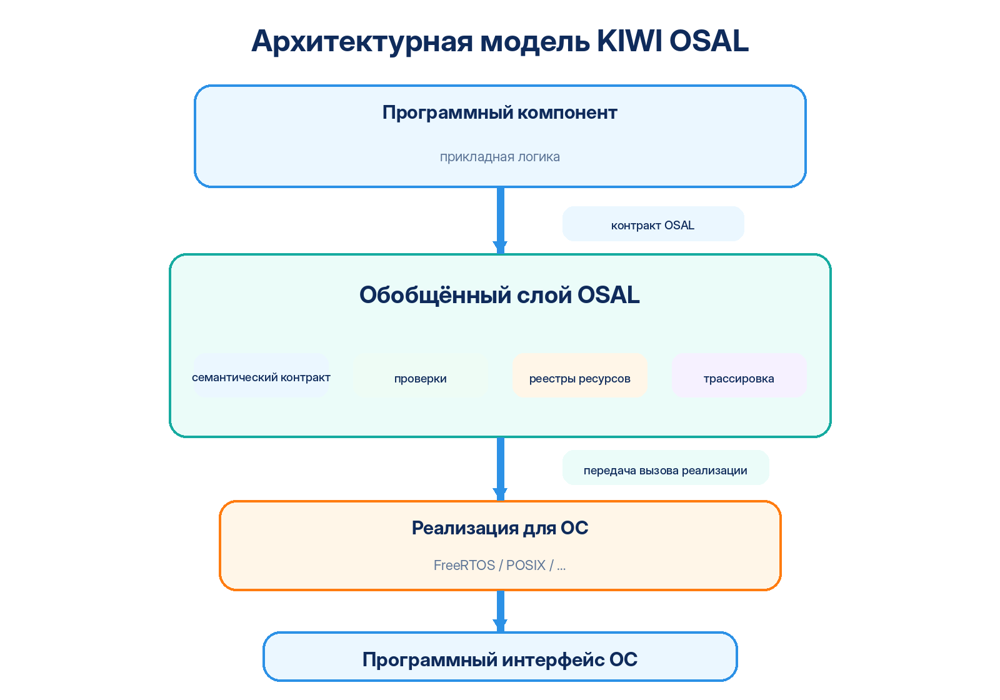
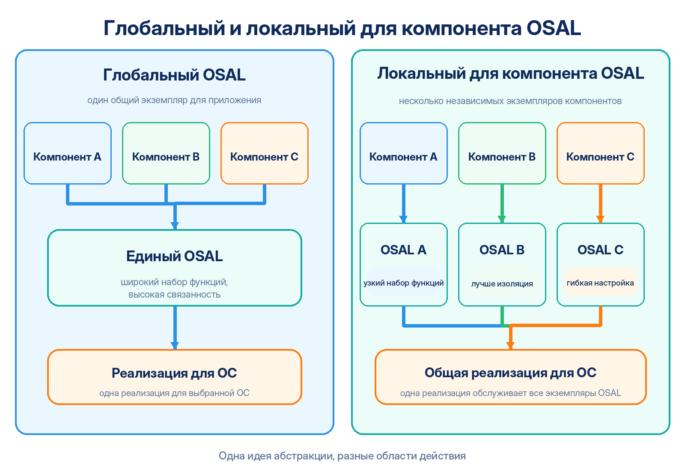
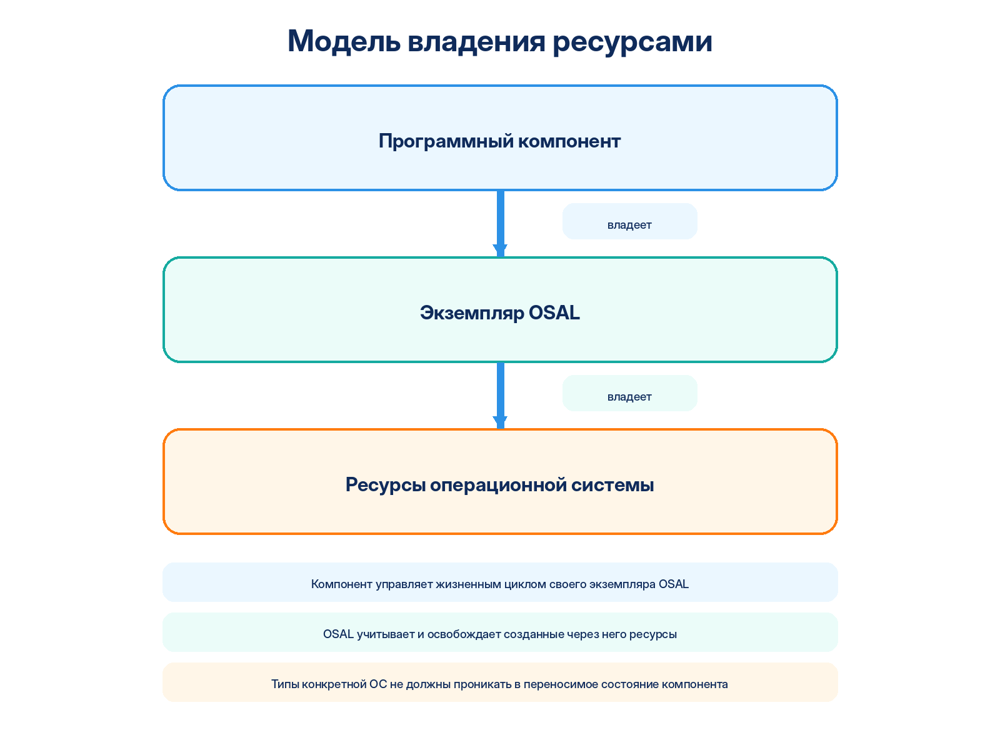
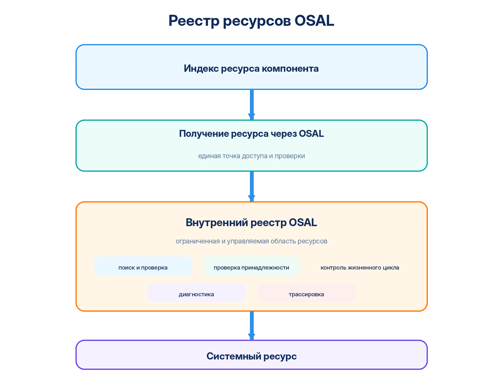
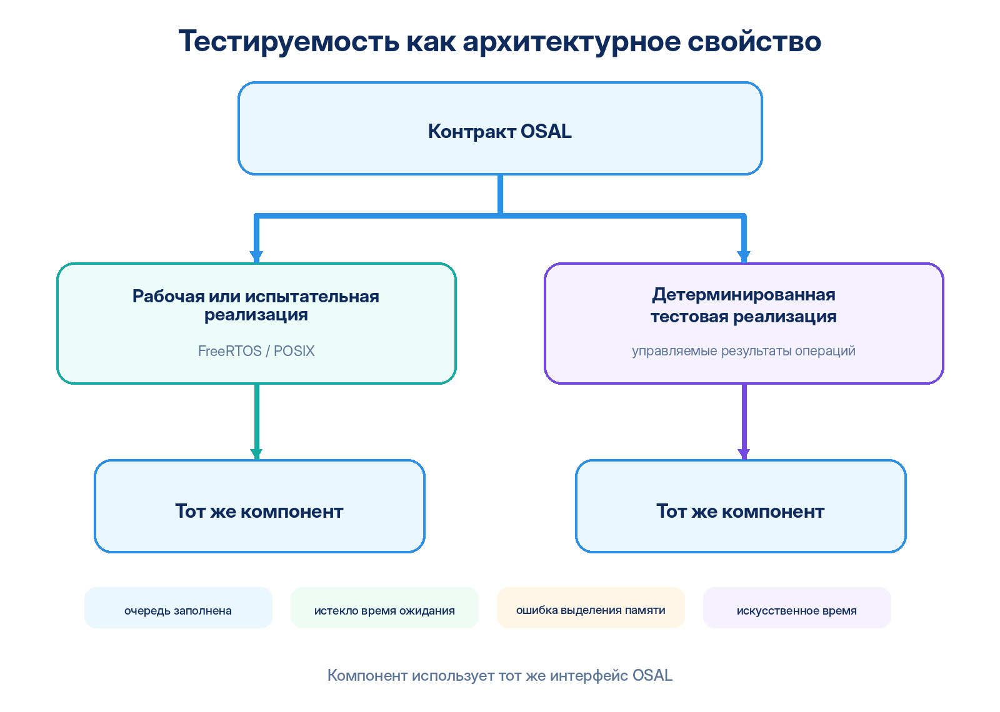

# Архитектура KIWI OSAL

## Содержание

1. [Что такое OSAL](#1-что-такое-osal)
2. [Какую проблему решает OSAL](#2-какую-проблему-решает-osal)
3. [Цена абстракции](#3-цена-абстракции)
4. [Один контракт — одно значение](#4-один-контракт--одно-значение)
5. [Архитектурная модель KIWI OSAL](#5-архитектурная-модель-kiwi-osal)
6. [Глобальный и локальный для компонента OSAL](#6-глобальный-и-локальный-для-компонента-osal)
7. [Связь с SOLID](#7-связь-с-solid)
8. [Многоэкземплярная модель](#8-многоэкземплярная-модель)
9. [Модель владения ресурсами](#9-модель-владения-ресурсами)
10. [Реестры ресурсов и устойчивые индексы](#10-реестры-ресурсов-и-устойчивые-индексы)
11. [Проверки во время выполнения и утверждения](#11-проверки-во-время-выполнения-и-утверждения)
12. [Трассировка и диагностика](#12-трассировка-и-диагностика)
13. [Внутренняя синхронизация ресурсов](#13-внутренняя-синхронизация-ресурсов)
14. [Тестируемость как часть архитектуры](#14-тестируемость-как-часть-архитектуры)
15. [Требования к реализации для конкретной ОС](#15-требования-к-реализации-для-конкретной-ос)
16. [Ещё один слой абстракции — зачем](#16-ещё-один-слой-абстракции--зачем)
17. [Что KIWI OSAL намеренно не делает](#17-что-kiwi-osal-намеренно-не-делает)
18. [Когда OSAL может быть не нужен](#18-когда-osal-может-быть-не-нужен)
19. [Частые возражения](#19-частые-возражения)
20. [Текущие группы примитивов KIWI OSAL](#20-текущие-группы-примитивов-kiwi-osal)
21. [Источники и дополнительные материалы](#21-источники-и-дополнительные-материалы)

---

## 1. Что такое OSAL

**OSAL — Operating System Abstraction Layer, слой абстракции операционной системы.**

Его основная задача — отделить программный компонент от конкретной операционной системы и её программного интерфейса, предоставив компоненту устойчивый набор операций для работы с системными ресурсами: потоками, очередями, примитивами синхронизации, таймерами, временем, памятью и другими службами ОС.

На первый взгляд OSAL легко принять за набор простых обёрток, где системной функции просто назначается новое имя:

| Функция конкретной ОС | Условная обёртка |
| --- | --- |
| `xQueueSend()` | `osalQueuePut()` |
| `xSemaphoreTake()` | `osalMutexLock()` |
| `vTaskDelay()` | `osalThreadDelay()` |

Но замена имён сама по себе почти ничего не абстрагирует.

Разные операционные системы отличаются не только названиями функций. Различаются:

- модели объектов;
- сигнатуры программных интерфейсов;
- типы идентификаторов системных объектов;
- правила создания, владения и удаления ресурсов;
- единицы измерения времени и представление бесконечного ожидания;
- модели ошибок и правила интерпретации возвращаемых значений;
- ограничения на вызовы из потока и обработчика прерывания;
- модели планировщика и приоритетов;
- поведение, которое в одной ОС задаётся явно, а в другой является неявным;
- исторически сложившаяся терминология.

Поэтому ключевой принцип KIWI OSAL формулируется так:

> **OSAL абстрагирует не имена системных вызовов, а их семантику.**

Компонент должен знать, **что** ему необходимо сделать, но по возможности не должен знать, **как именно** конкретная ОС выполняет это действие.

Это сдвигает акцент с механики реализации на смысл операции: не «какую функцию FreeRTOS вызвать в этом контексте», а «какая операция требуется компоненту».



---

## 2. Какую проблему решает OSAL

Прямое использование интерфейса ОС выглядит естественно, пока компонент существует только на одной платформе. В небольшой программе несложно хранить `QueueHandle_t`, вызывать `xQueueSend()` и вручную учитывать ограничения FreeRTOS.

Проблема появляется по мере роста компонента. Зависимость от конкретной ОС начинает распространяться по его структурам данных, обработке ошибок, правилам времени ожидания, логике инициализации и завершения, а также по веткам, зависящим от контекста вызова.

В итоге в одном прикладном компоненте смешиваются прикладная логика, особенности конкретной ОС, управление системными ресурсами, проверки контекста вызова, преобразование единиц времени и перевод системных ошибок.

Для сложных протоколов, драйверов, стеков связи и сервисов это особенно вредно: детали системных вызовов начинают заслонять прикладную задачу.

Вместо анализа состояния протокола разработчик вынужден помнить:

- разрешена ли операция из обработчика прерывания;
- существует ли специальный вариант функции для прерывания;
- в каких единицах задаётся время ожидания;
- кто владеет созданным объектом;
- как освободить объект при частично завершившейся инициализации;
- как конкретная ОС кодирует ошибку или истечение времени ожидания.

OSAL помещает эти вопросы на отдельную архитектурную границу. Прикладной компонент начинает зависеть не от FreeRTOS, POSIX или другой ОС, а от собственного системного контракта.

Переносимость при этом является важным, но не единственным результатом. Та же граница одновременно создаёт основу для:

- изолированного тестирования;
- единообразной проверки предусловий;
- централизованного учёта ресурсов;
- детерминированного освобождения ресурсов;
- трассировки;
- диагностики нарушений жизненного цикла;
- снижения количества платформенных деталей в прикладном коде.

---

## 3. Цена абстракции

Любая дополнительная абстракция имеет цену. KIWI OSAL не делает вид, что эта цена равна нулю.

В зависимости от выбранной конфигурации могут появиться:

- дополнительный код;
- дополнительное состояние экземпляра;
- таблица методов и косвенный вызов;
- проверки параметров и инвариантов;
- внутренние реестры ресурсов;
- трассировка;
- дополнительный интерфейс, который необходимо сопровождать.

В системах с крайне жёсткими ограничениями по памяти, времени отклика или предсказуемости эти расходы должны измеряться. Для части проверок может быть оправдана настраиваемая строгость.

Однако корректное инженерное сравнение должно учитывать не только прямую стоимость OSAL, но и код, который пришлось бы писать без него. Проверка ошибок, выбор функции для контекста прерывания, преобразование времени, освобождение ресурсов и обработка частичной инициализации всё равно никуда не исчезают. Без общего слоя они часто оказываются размножены по множеству мест прикладного кода.

Поэтому правильный вопрос звучит не «есть ли у OSAL накладные расходы», а:

> **Какова измеримая стоимость этой абстракции и какие свойства архитектуры система получает взамен?**

Для KIWI это прежде всего переносимость, тестируемость, единая семантика системных операций, наблюдаемое владение ресурсами, диагностируемость и возможность локальной настройки системного поведения компонента.

---

## 4. Один контракт — одно значение

KIWI OSAL рассматривает **семантическую согласованность** как часть программного интерфейса.

Одна и та же обобщённая операция должна иметь одинаковый наблюдаемый смысл независимо от конкретной реализации для ОС. Это принципиально отличает слой абстракции от набора псевдонимов для системных функций.

Если функция с одинаковым названием в одной реализации блокируется, в другой выполняет опрос, в третьей принимает время в иных единицах, а ошибки трактуются по-разному, общий префикс в имени не создаёт настоящей абстракции.

### 4.1 Согласованная терминология

KIWI использует ограниченный набор глаголов и старается не копировать историческую терминологию отдельных ОС.

| Термин | Семантический смысл |
| --- | --- |
| `Create` | Создать системный ресурс, зарегистрировать его в экземпляре OSAL и установить владение. |
| `Delete` | Освободить ресурс и удалить его из внутреннего реестра. |
| `Put` | Немедленная операция со стороны производителя; ожидание свободного места отсутствует. |
| `Post` | Операция со стороны производителя с явным максимальным временем ожидания. |
| `Get` | Немедленное получение уже доступных данных или состояния. |
| `Wait` | Ожидающая операция; конкретная форма определяется природой примитива. |
| `Pend` | Получение ресурса или данных с явным ограничением времени ожидания. |
| `TryLock` | Немедленная попытка захватить мьютекс без ожидания. |
| `Lock` | Захват мьютекса с неограниченным ожиданием. |
| `PendLock` | Захват мьютекса с явным ограничением времени ожидания. |
| `Unlock` | Освобождение ранее захваченного мьютекса. |
| `Set` / `Clear` | Установить или сбросить флаги состояния. |
| `Start` / `Stop` | Запустить или остановить уже существующий таймер. |
| `Reset` | Вернуть объект в определённое исходное состояние или перезапустить период таймера. |

Не каждый термин обязан использоваться каждой группой примитивов. Согласованность здесь означает единый смысл там, где термин применим, а не искусственное выравнивание всех сигнатур.

### 4.2 Матрица основных операций

| Группа | Немедленно | С ограниченным ожиданием | С неограниченным ожиданием | Дополнительные операции |
| --- | --- | --- | --- | --- |
| Очередь, запись | `Put` | `Post` | `Post` с `TEMPLATE_OSAL_INFINITY_TOUT` | `Reset` |
| Очередь, чтение | `Get` | `Pend` | `Wait` | `Reset` |
| Потоковый буфер, запись | `Put` | `Post` | `Post` с `TEMPLATE_OSAL_INFINITY_TOUT` | `Reset` |
| Потоковый буфер, чтение | `Get` | `Pend` | `Wait` | `Reset` |
| Счётный семафор | `Pend` с нулевым временем ожидания | `Pend` | `Wait` | `Post`, `CountGet` |
| Мьютекс | `TryLock` | `PendLock` | `Lock` | `Unlock` |
| Флаги событий | `Get` | `Wait` | `Wait` с `TEMPLATE_OSAL_INFINITY_TOUT` | `Set`, `Clear` |
| Программный таймер | — | — | — | `Start`, `Stop`, `Reset` |

Важный нюанс: `Wait` не объявляется универсальным синонимом «обязательно бесконечное ожидание» для всех возможных примитивов. Например, для флагов событий операция ожидания естественно объединяет маску флагов, режим `WAIT_ANY/WAIT_ALL`, правило очистки и время ожидания. Главное требование — не идентичная форма функций, а предсказуемая семантика на границе компонента.

---

## 5. Архитектурная модель KIWI OSAL

Система разделена на две основные части.

### 5.1 Обобщённый слой

Он определяет:

- интерфейс, видимый компоненту;
- общие типы;
- семантику операций;
- модель жизненного цикла;
- правила владения ресурсами;
- внутренние реестры;
- общие проверки;
- передачу вызова реализации для выбранной ОС.

### 5.2 Реализация для конкретной ОС

Она переводит общий контракт в термины и механизмы выбранной системы:

| На стороне OSAL | На стороне конкретной ОС |
| --- | --- |
| время ожидания OSAL | системное представление времени ожидания |
| уровень приоритета OSAL | приоритет планировщика |
| объект OSAL | системный объект |
| результат системной операции | код ошибки OSAL |
| обобщённая операция | корректный системный вызов |

Реализация может быть внутренне совершенно иной. FreeRTOS, POSIX и будущая реализация для другой ОС не обязаны использовать одинаковые механизмы. Они обязаны сохранять одинаковое наблюдаемое поведение общего интерфейса.

Концептуально это модель «интерфейс + взаимозаменяемая реализация». В C она выражена через композицию структур и таблицу методов, а не через языковое наследование.

Направление зависимости принципиально важно: прикладная логика зависит от общего контракта OSAL, а реализация для конкретной ОС подстраивается под этот контракт. Компонент не должен подстраиваться под особенности выбранной ОС. Эта зависимость показана на архитектурной схеме выше.

---

## 6. Глобальный и локальный для компонента OSAL

Один из ключевых принципов KIWI — область действия OSAL задаётся программным компонентом, который им пользуется.

Это не означает, что глобальный OSAL «неправильный». Глобальная и локальная модели — разные точки одной шкалы области действия: от отдельного компонента через подсистему и приложение до целой программной платформы.



### 6.1 Глобальный OSAL

Один общий экземпляр удобен, когда проект имеет устойчивую архитектуру и единый системный контракт. Его преимущества:

- единая точка конфигурации;
- меньше служебных структур;
- один интерфейс для всего приложения;
- простая модель связывания.

Цена такого подхода проявляется по мере роста проекта:

- интерфейс расширяется требованиями множества подсистем;
- повышается цена изменения контракта;
- растёт связанность;
- каждая реализация для новой ОС должна поддерживать всё более крупный набор возможностей;
- становится сложнее локально изменить политику только одного компонента.

### 6.2 Локальный для компонента OSAL

Компонент получает только те группы системных операций, которые ему действительно нужны. Это особенно естественно для:

- драйверов;
- библиотек;
- стеков протоколов;
- промежуточного программного обеспечения;
- служб связи;
- фреймворков;
- многократно создаваемых однотипных модулей.

Преимущества:

- меньшая поверхность интерфейса;
- ясная граница владения;
- проще переносить компонент как самостоятельную единицу;
- проще строить тестовую среду;
- легче включать строгие проверки только для нужного компонента;
- возможно иметь разные параметры системной политики для разных экземпляров.

Недостатки тоже существуют:

- несколько экземпляров требуют дополнительного состояния;
- часть инфраструктуры может повторяться;
- сложнее организовать проект, если границы компонентов определены плохо.

Главная идея KIWI состоит не в отрицании глобального подхода, а в возможности выбирать область действия абстракции осознанно.

---

## 7. Связь с SOLID

KIWI OSAL особенно хорошо соотносится с тремя принципами SOLID.

### 7.1 Принцип разделения интерфейсов (ISP)

Компонент не должен зависеть от методов, которыми не пользуется. Генератор поэтому включает только выбранные группы примитивов. Компоненту, которому нужна только очередь, не требуется зависеть от таймеров, потоков и семафоров.

### 7.2 Принцип инверсии зависимостей (DIP)

Прикладная логика зависит от собственного общего контракта OSAL. Реализация FreeRTOS или POSIX находится ниже этого контракта и подстраивается под него.

### 7.3 Принцип подстановки Лисков (LSP)

Взаимозаменяемость реализаций возможна только при сохранении наблюдаемой семантики. Если реализация FreeRTOS и реализация POSIX по-разному трактуют одну и ту же операцию, настоящей заменяемости нет. Поэтому правило «один контракт — одно значение» является не косметикой, а условием корректной подстановки реализации.

Не следует искусственно объявлять OSAL воплощением всего SOLID целиком. Полезнее точно указывать те принципы, которые реально выражены в архитектуре.

---

## 8. Многоэкземплярная модель

Локальный OSAL естественно сочетается с многократным развёртыванием одного и того же компонента.

Например, два экземпляра коммуникационного стека могут работать через одну и ту же FreeRTOS, но иметь:

- разные внутренние реестры;
- разные наборы ресурсов;
- разные параметры приоритетов;
- разные политики распределения потоков по ядрам;
- независимый жизненный цикл.

При этом несколько экземпляров OSAL могут использовать одну и ту же реализацию для ОС: различаются состояние, реестры и параметры экземпляров, а системный код реализации остаётся общим. Это показано на схеме в разделе 6.

Это важное отличие от набора глобальных функций-обёрток: политика взаимодействия с ОС становится частью экземпляра, а не только свойством всей программы.

---

## 9. Модель владения ресурсами

Базовый инвариант KIWI OSAL прост:

> **Компонент владеет экземпляром OSAL. Экземпляр OSAL владеет системными ресурсами, созданными через него.**



Это делает жизненный цикл ресурсов наблюдаемым и проверяемым.

Идентификаторы очередей, мьютексов, семафоров, потоков и таймеров принадлежат общему интерфейсу OSAL. Конкретный тип FreeRTOS или другой ОС не должен становиться частью переносимого состояния компонента.

Например, `QueueHandle_t` является деталью FreeRTOS, тогда как `Template_osalQueueHandle_t` представляет обобщённый непрозрачный идентификатор очереди на границе OSAL.

Для памяти действует другая семантика. Результат выделения памяти — реальный адрес участка памяти, поэтому KIWI использует понятие `memPtr`, а не искусственный `MemHandle`.

Это важное правило терминологии:

- **идентификатор объекта** — непрозрачная ссылка на системный объект; в именах типов и функций ей соответствует `Handle`;
- **указатель** — адрес памяти, которым компонент действительно оперирует как памятью; в именах используется `Ptr`.

---

## 10. Реестры ресурсов и устойчивые индексы

Ресурсы, созданные через экземпляр OSAL, учитываются во внутренних реестрах фиксированной ёмкости.



Это даёт сразу несколько свойств.

### 10.1 Проверяемое владение

Переданный объект можно проверить на принадлежность конкретному экземпляру. Ошибка «передали объект другого компонента» обнаруживается на границе OSAL, а не проявляется позже как повреждение состояния ОС.

### 10.2 Детерминированное освобождение

При завершении экземпляр знает, какие ресурсы были созданы через него, и может выполнить контролируемое освобождение.

### 10.3 Ограниченная модель ресурсов

Количество ячеек реестра задаётся конфигурацией:

```c
TEMPLATE_OSAL_QUEUE_SLOTS_NUM
TEMPLATE_OSAL_THREAD_SLOTS_NUM
TEMPLATE_OSAL_MEM_SLOTS_NUM
```

Это означает, что верхняя граница числа учитываемых объектов известна заранее. Для встроенных систем такая ограниченность является полезным свойством: ресурсная модель компонента становится явной.

### 10.4 Диагностика

На одной границе можно обнаруживать:

- неизвестный идентификатор объекта;
- объект другого экземпляра;
- двойное удаление;
- исчерпание ячеек реестра;
- нарушение жизненного цикла;
- оставшиеся ресурсы при завершении;
- ошибки регистрации и освобождения.

### 10.5 Реестр не является песочницей безопасности

Важно не переоценивать возможности этой модели. Код, выполняющийся в том же адресном пространстве и с теми же привилегиями, теоретически может обойти OSAL и обратиться к ОС напрямую.

Поэтому реестр OSAL — это прежде всего **контролируемая область ресурсов и механизм раннего обнаружения неправильного поведения**, а не полноценная защита от злонамеренного кода.

Для настоящей изоляции нужны дополнительные средства: блок защиты памяти (MPU), блок управления памятью (MMU), разделение привилегий, процессы или иные аппаратные и программные механизмы защиты.

---

## 11. Проверки во время выполнения и утверждения

Граница OSAL является естественным местом для проверки системного контракта компонента. Однако все проверки нельзя сваливать в одну категорию.

### 11.1 Нарушения программных инвариантов

Примеры:

- нулевой указатель там, где он невозможен по контракту;
- отсутствующая таблица методов у уже инициализированного экземпляра;
- выход внутреннего индекса за допустимый диапазон;
- состояние, которое не может возникнуть при корректной работе программы.

Такие случаи являются ошибкой программирования и естественно выражаются утверждениями (`assert`). В отладочной сборке они должны быть максимально заметны.

### 11.2 Штатные рабочие отказы

Примеры:

- очередь заполнена;
- очередь пуста;
- истекло время ожидания;
- не удалось выделить память;
- исчерпан реестр ресурсов.

Это не нарушение инварианта. Такие ситуации должны возвращаться через `Template_osalErr_e` и обрабатываться вызывающим кодом.

### 11.3 Проверки, являющиеся частью самой операции

Самая важная категория — проверки, без которых нельзя корректно выбрать системный вызов.

Например, FreeRTOS имеет отдельные функции для обычного контекста и для обработчика прерывания. Проверка контекста может определять, будет вызван обычный вариант или вариант `FromISR`.

Такая проверка — не диагностическая роскошь. Она является частью реализации операции и не может быть просто отключена ради ускорения.

Общее правило:

> **Не всякая проверка OSAL является отключаемой диагностикой. Часть проверок непосредственно обеспечивает корректность системного вызова.**

---

## 12. Трассировка и диагностика

Почти всё взаимодействие компонента с ОС проходит через одну контролируемую границу. Это делает OSAL естественной точкой наблюдения.

Можно последовательно фиксировать:

- создание и удаление ресурсов;
- операции очередей и потоковых буферов;
- захват и освобождение мьютексов;
- операции семафоров;
- установку и ожидание флагов событий;
- жизненный цикл потоков и таймеров;
- выделение и освобождение памяти;
- истечение времени ожидания;
- ошибки реализации для ОС;
- неправильный контекст вызова;
- завершение и освобождение ресурсов.

Это особенно полезно для ошибок, чувствительных ко времени. Точка останова изменяет расписание потоков и момент прихода событий, поэтому часть гонок и редких отказов под отладчиком исчезает. Трассировка позволяет наблюдать систему без обязательной остановки выполнения.

Механизм трассировки должен быть заменяемым и настраиваемым: конкретный проект может направить события в `printf`, собственный журнал, двоичный канал диагностики или другой механизм.

При этом сама трассировка обязана учитывать контекст. То, что OSAL допускает вызов из обработчика прерывания, не делает произвольный `printf()` безопасным внутри такого вызова.

---

## 13. Внутренняя синхронизация ресурсов

Реестры ресурсов являются общим состоянием экземпляра OSAL и должны защищаться от одновременного изменения.

Для этого реализация для ОС имеет собственный внутренний мьютекс управления ресурсами.

Он принципиально не является тем же объектом, что мьютексы, доступные компоненту:

- принадлежит самой реализации OSAL;
- защищает поиск свободной ячейки реестра;
- защищает регистрацию и удаление;
- защищает внутренний учёт;
- участвует в завершении экземпляра;
- не помещается в открытый реестр мьютексов компонента;
- создаётся непосредственно средствами ОС.

Последний пункт предотвращает рекурсивную зависимость. Для работы реестра уже нужен внутренний мьютекс; если создавать этот мьютекс через открытый интерфейс мьютексов, для его регистрации потребуется тот самый реестр, который ещё не защищён и фактически ещё не готов к работе.

Внутренняя синхронизация должна принадлежать конкретному экземпляру, а не быть глобальным изменяемым состоянием для всех OSAL.

---

## 14. Тестируемость как часть архитектуры

Переносимость и тестируемость являются двумя следствиями одной и той же архитектурной границы.

Если компонент зависит только от своего OSAL, рабочую реализацию можно заменить другой без изменения исходного кода компонента.



При этом полезно различать два типа тестовой среды.

### 14.1 Реализация для среды разработки и испытаний

Например, будущая реализация на POSIX может позволить исполнять компонент на обычном ПК.

Это не набор заглушек. Поток остаётся настоящим потоком, очередь — очередью, мьютекс действительно синхронизирует выполнение. Такой вариант подходит для:

- интеграционных испытаний;
- системных испытаний;
- симуляций;
- длительных прогонов;
- выполнения в системе непрерывной интеграции (CI);
- проверки взаимодействия нескольких компонентов.

### 14.2 Детерминированная тестовая реализация

Её цель другая: дать тестовой среде возможность заранее задавать результат системных операций.

Например:

| Управляемая операция | Заданный результат |
| --- | --- |
| Очередь: `Put` | успех |
| Очередь: `Put` | очередь заполнена |
| Очередь: `Pend` | истекло время ожидания |
| Память: `Malloc` | ошибка выделения памяти |
| Поток: `Create` | ошибка создания |
| Время: `TimeMsGet` | заданное искусственное время |

Так можно воспроизводимо проверять ветки ошибок, которые на реальном устройстве возникают редко или требуют сложного состояния всей системы.

Важно, что специальные средства управления тестом принадлежат тестовой среде, а не публичному интерфейсу компонента. Компонент продолжает видеть обычный OSAL и обычные коды результата.

---

## 15. Требования к реализации для конкретной ОС

Каждая реализация должна сохранять общий контракт, даже если собственный интерфейс ОС устроен иначе.

На неё возлагаются:

- преобразование времени ожидания;
- представление бесконечного ожидания средствами конкретной ОС;
- отображение уровней приоритета;
- выбор допустимого вызова для потока или обработчика прерывания;
- создание и удаление системных объектов;
- преобразование системных ошибок в ошибки OSAL;
- собственное состояние жизненного цикла;
- внутренняя синхронизация реестров;
- проверка параметров конкретной ОС;
- нормализация параметров экземпляра.

### 15.1 Значения по умолчанию и параметры экземпляра

Реализация может иметь стандартную политику, задаваемую при сборке, и одновременно позволять переопределять её для конкретного экземпляра.

Принцип должен быть однозначным:

| Состояние `param` | Поведение |
| --- | --- |
| `param == NULL` | используется стандартное поведение реализации |
| `param != NULL` | параметры обязательно проверяются, после чего применяются явно заданные группы |

Явно переданная ошибочная конфигурация не должна молча заменяться значениями по умолчанию. Отсутствующая настройка и неверная настройка — разные состояния.

Для FreeRTOS примером такой политики служит отображение уровней `LOW/NORMAL/HIGH/CRITICAL` в конкретные приоритеты планировщика. В многоядерной конфигурации (SMP) дополнительной политикой может быть привязка потоков к ядрам.

### 15.2 Бесконечное ожидание

Общий интерфейс использует `TEMPLATE_OSAL_INFINITY_TOUT`. Реализация FreeRTOS переводит его в собственное значение FreeRTOS — `portMAX_DELAY`.

Общий слой не должен придумывать за ОС её внутреннее представление бесконечного ожидания.

---

## 16. Ещё один слой абстракции — зачем

Во встроенной разработке уже существует множество слоёв: аппаратные абстракции (HAL), пакеты поддержки плат (BSP), CMSIS, интерфейсы операционных систем реального времени и библиотеки производителей. Поэтому вопрос «зачем ещё один?» совершенно нормален.

Ответ начинается с области ответственности.

### 16.1 Разные абстракции скрывают разные границы

| Подход | Основная область |
| --- | --- |
| HAL производителя | Аппаратные блоки и семейства внутри экосистемы производителя |
| BSP | Конкретная плата и её аппаратная конфигурация |
| CMSIS-RTOS2 | Стандартизованный интерфейс распространённых служб ОСРВ для Arm Cortex |
| NASA OSAL | Системный слой абстракции ОС для программной платформы cFS |
| KIWI OSAL | Системный контракт отдельного программного компонента |

CMSIS-RTOS2 действительно является обобщённым интерфейсом операционных систем реального времени и специально предназначен для уменьшения зависимости прикладного ПО от конкретной операционной системы реального времени. Это полезная и зрелая абстракция. Но её область определена стандартом CMSIS и экосистемой Arm Cortex, тогда как KIWI решает другую задачу: генерирует контракт, принадлежащий конкретному компоненту и содержащий только необходимые ему группы операций.

NASA OSAL, напротив, является хорошим примером крупного системного OSAL. NASA прямо описывает его как библиотеку, изолирующую встроенное приложение от конкретной ОСРВ и предоставляющую общий интерфейс к системным службам. Это подтверждает саму архитектурную идею, но область действия NASA OSAL значительно шире области отдельного компонента KIWI.

Таким образом, вопрос должен звучать не «существует ли уже какой-нибудь слой абстракции», а:

> **Совпадает ли область его контракта с границей переносимости конкретного компонента?**

Если совпадает — дополнительный OSAL действительно может быть не нужен. Если нет — наличие другого абстрактного интерфейса само по себе проблему не решает.

---

## 17. Что KIWI OSAL намеренно не делает

KIWI не пытается объединить все возможности всех поддерживаемых ОС.

Если FreeRTOS предлагает пять вариантов создания объекта, это не означает, что общий интерфейс должен получить пять соответствующих функций.

Иначе общий слой постепенно превратится в сумму возможностей FreeRTOS, POSIX, CMSIS и всех будущих ОС, то есть фактически станет ещё одним большим системным интерфейсом.

Общий контракт расширяется только тогда, когда появляется новая **семантика, необходимая компоненту**, а не потому, что новая функция существует в одной из ОС.

Кроме того, OSAL не является:

- полноценной системой безопасности;
- заменой аппаратных механизмов защиты памяти (MPU/MMU);
- универсальным планировщиком;
- заменой драйверов оборудования;
- обещанием переносимости любой системно-зависимой функции без компромиссов.

---

## 18. Когда OSAL может быть не нужен

OSAL не является обязательным решением для любого кода.

Отдельный слой может быть неоправдан, если:

- код сознательно и навсегда привязан к одной ОС;
- особая функция этой ОС является частью публичного контракта самого компонента;
- компонент настолько мал, что отдельная системная граница не даёт практической выгоды;
- измеренные ограничения по памяти или задержке делают конкретную реализацию OSAL неприемлемой;
- общий интерфейс неизбежно должен полностью повторить интерфейс выбранной ОС один к одному.

Последний случай особенно важен. Если слой лишь повторяет программный интерфейс FreeRTOS теми же функциями под другим префиксом, это не полноценная абстракция, а переименование.

---

## 19. Частые возражения

### «Почему просто не вызывать FreeRTOS напрямую?»

Если компонент действительно навсегда является частью конкретного FreeRTOS-приложения и не требует изолированного тестирования, это может быть нормальным решением. KIWI нужен там, где системная зависимость должна иметь чёткую границу.

### «Разве таблица методов не создаёт лишний вызов?»

Создаёт определённую стоимость косвенного вызова. Она должна измеряться там, где это существенно. Но сравнивать необходимо с полной стоимостью альтернативы: дублированными проверками, системно-зависимыми типами, сложным тестированием и более высокой ценой переноса.

### «Почему не использовать CMSIS-RTOS2?»

Использовать можно и иногда это лучший выбор. CMSIS-RTOS2 решает задачу стандартизации интерфейса ОСРВ для Arm Cortex. KIWI решает задачу системного контракта конкретного компонента, его владения ресурсами, реестров, параметров экземпляра и генерации только нужных групп операций. Эти области пересекаются, но не совпадают полностью.

### «Зачем внутренний реестр, если можно хранить идентификаторы прямо в компоненте?»

Хранить можно. Реестр нужен, когда важны проверяемое владение, ограниченная ресурсная модель, детерминированное завершение, трассировка и обнаружение неверных идентификаторов на одной границе.

### «Почему не один глобальный OSAL?»

Иногда именно он и нужен. KIWI не запрещает крупную область действия. Локальная модель полезна, когда компонент должен быть самостоятельной переносимой единицей или когда разные экземпляры требуют разных политик.

### «Почему нельзя просто подменить системные функции в тесте?»

Можно. Но отдельный системный контракт делает такую подмену явной частью архитектуры и позволяет иметь как настоящую реализацию для среды разработки, так и управляемую тестовую реализацию, не встраивая тестовые ветви в прикладной код.

---

## 20. Текущие группы примитивов KIWI OSAL

Текущий генератор и реализация FreeRTOS поддерживают следующие группы:

| Группа | Основные операции |
| --- | --- |
| Очередь | `Create`, `Delete`, `Put`, `Post`, `Get`, `Wait`, `Pend`, `Reset`, `HandleGet` |
| Потоковый буфер | `Create`, `Delete`, `Put`, `Post`, `Get`, `Wait`, `Pend`, `Reset`, `HandleGet` |
| Мьютекс | `Create`, `Delete`, `TryLock`, `Lock`, `PendLock`, `Unlock`, `HandleGet` |
| Счётный семафор | `Create`, `Delete`, `Wait`, `Pend`, `Post`, `CountGet`, `HandleGet` |
| Флаги событий | `Create`, `Delete`, `Set`, `Clear`, `Get`, `Wait`, `HandleGet` |
| Поток | `Create`, `Delete`, `Suspend`, `Resume`, `Delay`, `DelayUntil`, `Exit`, `HandleGet` |
| Критическая секция | `Enter`, `Exit` |
| Программный таймер | `Create`, `Delete`, `Start`, `Stop`, `Reset`, `HandleGet` |
| Время | `TimeMsGet` |
| Память | `Malloc`, `Free`, `MemPtrGet` |

Для потоков общий уровень использует четыре фиксированных уровня: `LOW` → `NORMAL` → `HIGH` → `CRITICAL`.

Числовые значения общего перечисления фиксированы, а конкретная реализация ОС отображает их в собственную модель приоритетов.

Коды ошибок также имеют явно назначенные сквозные значения. Уже присвоенные значения не должны изменяться или использоваться повторно, чтобы сохранялась обратная совместимость журналов, диагностических данных и таблиц соответствия.

---

## 21. Источники и дополнительные материалы

Архитектура KIWI является собственной моделью проекта, но опирается на давно используемые идеи инверсии зависимостей, сегрегации интерфейсов, системной абстракции и тестовых швов.

1. **NASA Core Flight System OSAL** — пример системного слоя абстракции ОС для встроенного ПО:
   <https://github.com/nasa/osal>

2. **NASA Software Catalog — Operating System Abstraction Layer** — описание назначения OSAL и реализаций для нескольких ОС, включая Linux/POSIX для разработки и испытаний:
   <https://software.nasa.gov/software/GSC-18370-1>

3. **Arm CMSIS-RTOS2** — стандартизованный обобщённый интерфейс ОСРВ для Arm Cortex:
   <https://arm-software.github.io/CMSIS_6/main/RTOS2/index.html>

4. **Документация ядра FreeRTOS** — системные примитивы, многоядерный режим (SMP) и политика привязки задач к ядрам:
   <https://www.freertos.org/Documentation/>

5. James W. Grenning, **Test-Driven Development for Embedded C**, Pragmatic Bookshelf — тестовые двойники, разрыв зависимостей и тестирование встроенного ПО вне целевого оборудования.

6. Robert C. Martin, материалы по **SOLID**, инверсии зависимостей и разделению интерфейсов — общая архитектурная основа зависимости от абстракции вместо конкретной реализации.

---

## Краткое резюме

KIWI OSAL — не попытка скрыть FreeRTOS за другим набором имён. Его цель — создать контролируемую семантическую границу между программным компонентом и операционной средой.

Эта граница:

- отделяет прикладной смысл от механики системных вызовов;
- делает владение системными ресурсами явным;
- позволяет централизовать проверки и трассировку;
- поддерживает многоэкземплярную конфигурацию;
- упрощает перенос на другую ОС;
- создаёт естественную границу для тестирования;
- не требует экспортировать весь интерфейс выбранной ОС в прикладной код.

Основная идея может быть сведена к одной фразе:

> **Компонент должен формулировать, что ему требуется от операционной среды. Реализация OSAL отвечает за то, как эта потребность выполняется конкретной ОС.**
